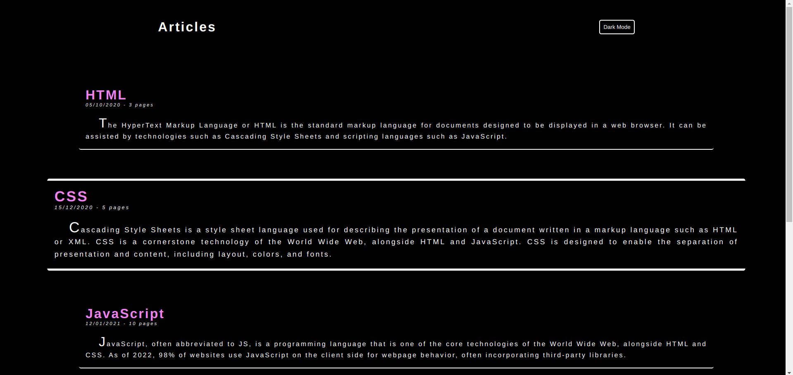
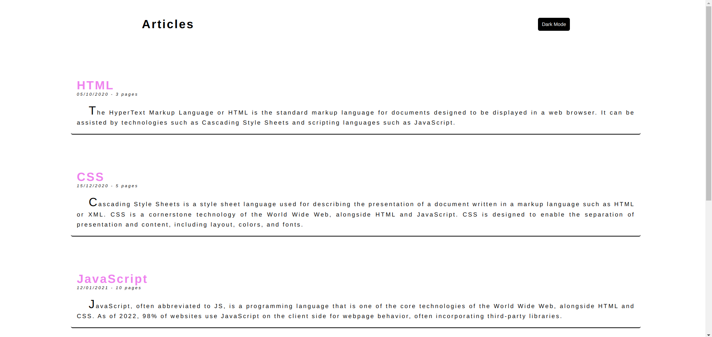

# DARK MODE PROJECT

## FRONTEND PRACTICE PROJECT NO: 18

1. I used Javascript, Jquery, HTML, CSS to practice my skills.

2. There are several articles in the page.

3. When we click on the button on right top corner we can switch between dark and light modes.
